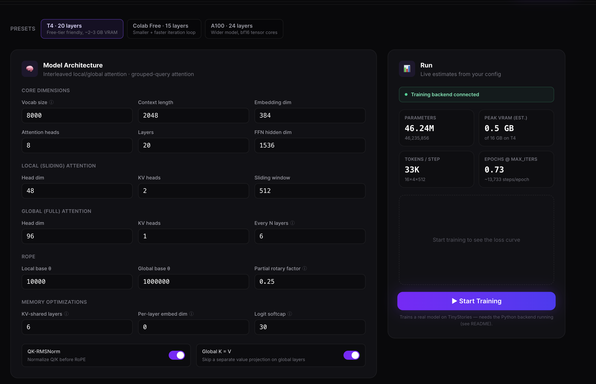
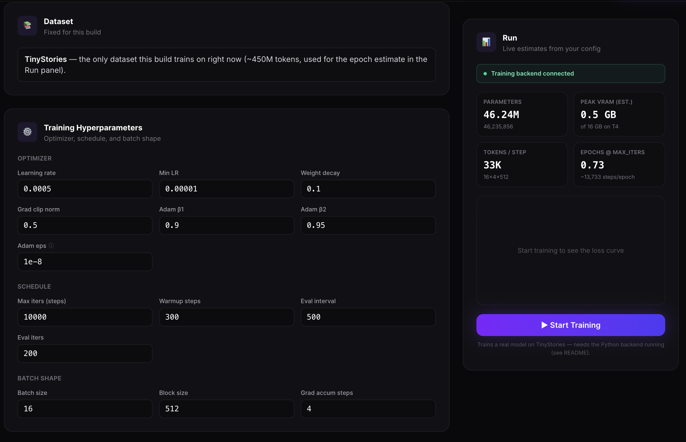

# IdeaWeaver SLM Builder

An interactive configurator for a from-scratch, Gemma-4-Nano-style small language model —
interleaved local/global attention, grouped-query attention, QK-RMSNorm, partial RoPE, and
cross-layer KV-cache sharing. Tune every architecture and training variable, see a live
parameter-count and VRAM estimate update as you go, then **actually train it** on TinyStories
and watch a real loss curve.

Built by [IdeaWeaver AI Labs](https://ideaweaver.ai) to go with the
[Building Small Language Models from Scratch](https://ideaweaver.ai/#courses) course.

## Screenshots

**Model Architecture** — every attention/RoPE/KV-sharing knob, with live parameter and VRAM
estimates and a connected training backend in the Run panel:



**Dataset and Training Hyperparameters** — optimizer, schedule, and batch shape, ready to train:



## How it fits together

- **`src/`** — the Next.js frontend: the configurator UI, live parameter/VRAM estimator, and the
  loss chart. Talks to the backend only through its own `/api/train/*` routes (never directly),
  so it works the same locally and inside the Colab iframe.
- **`backend/`** — a small FastAPI service (`train_service.py`) that builds the *exact* model
  you configured (`model.py`, ported from the reference training script) and actually trains it
  on TinyStories (`build_tokenizer.py`), streaming real loss back over Server-Sent Events.

## Run it on Google Colab

[](https://colab.research.google.com/github/ideaweaver-ai/ideaweaver-slm-builder/blob/main/IdeaWeaver_SLM_Builder.ipynb)

1. **Open the notebook.** Click the badge above, or go to
   [colab.research.google.com](https://colab.research.google.com) → **File → Open notebook → GitHub**,
   paste `ideaweaver-ai/ideaweaver-slm-builder`, and pick `IdeaWeaver_SLM_Builder.ipynb`.
2. **Pick a GPU runtime.** *Runtime → Change runtime type → T4 GPU.* Training works on CPU too,
   but it's slow enough to not be worth it — use a GPU.
3. **Run everything.** *Runtime → Run all* (or `Cmd/Ctrl + F9`). Approve the "run anyway" warning
   if Colab shows one — that's normal for any notebook not authored by Google.
4. **Watch it work through the setup cells:** clone the repo → install Node 20 + frontend deps →
   install the backend's Python deps (skipping `torch`/`numpy`, which Colab already has with CUDA)
   → start the training backend on port 8001 → **build** and start the frontend in production mode
   on port 3000 and embed it. (Production mode, not `next dev` — dev mode's hot-reload websocket
   doesn't survive being proxied through Colab's iframe and silently breaks React entirely, so the
   build step here is required, not optional.)
5. **Use the app.** Scroll to the last cell — the IdeaWeaver SLM Builder UI renders directly in the
   notebook. The **Run** card shows a live 🟢/🔴 "training backend connected" indicator — check
   that's green before clicking Start Training. Configure the architecture, then click
   **Start Training**. The first run spends several minutes downloading and tokenizing TinyStories
   (watch the status line under the chart); every run after that reuses the cached data. **Stop**
   anytime and download the checkpoint.
6. **(Optional) Get a public link.** The second-to-last cell spins up a
   [`cloudflared` quick tunnel](https://developers.cloudflare.com/cloudflare-one/connections/connect-networks/do-more-with-tunnels/trycloudflare/)
   and prints a real `https://…trycloudflare.com` URL you can open outside Colab or share — the
   embedded iframe works fine without it, this is only for that.
7. **To stop or restart**, use *Runtime → Restart session* and *Run all* again.

**If "Start Training" does nothing — and nothing else on the page responds either (presets,
inputs, etc.):** the page loaded but React never hydrated. This happens if the frontend is somehow
running in dev mode (`next dev`) behind a proxy instead of the production build the notebook uses
by default — confirm the "Build and start the frontend" cell actually ran `npm run build` first. A
quick way to check: open your browser's DevTools console — repeated `WebSocket ... webpack-hmr ...
502` errors mean you're looking at a dev-mode server, and clicks will silently do nothing no matter
what the 🟢/🔴 indicator says.

**If the page is otherwise interactive but "Start Training" specifically does nothing:** check the
🟢/🔴 indicator in the Run card — red means the browser can't reach the backend. Scroll up to the
"Start the training backend" cell's output; if it shows a traceback, that's the real error (a
failed `pip install`, a port conflict, etc.). If that cell shows "Training backend is up" but the
indicator is still red, re-run the frontend cell.

## Run it locally

Needs two processes: the backend (Python/PyTorch) and the frontend (Next.js).

```bash
# Backend — trains the real model
cd backend
pip install -r requirements.txt   # or your own torch install if you already have one
uvicorn train_service:app --port 8001

# Frontend — in a second terminal, from the repo root
npm install
npm run dev
```

Then open http://localhost:3000. Training runs on GPU automatically if `torch.cuda.is_available()`;
otherwise it falls back to CPU (correct, but slow for anything beyond a tiny config).

`npm run dev` is fine for plain `localhost` access. If you're exposing the app through anything
that proxies it (a tunnel like `ngrok`/`cloudflared`, a reverse proxy, etc.), use a production
build instead — `npm run build && npm run start` — dev mode's hot-reload websocket doesn't survive
most proxies and silently breaks React hydration (the page loads, but clicking anything does
nothing). This is exactly what the Colab notebook does and why.

## Pushing a trained model to Hugging Face

The Run panel always shows a **Push to Hugging Face** form — your Hugging Face username, a repo
name, a token with write access, and a public/private toggle. The push button stays disabled with
a "train a model first" hint until a run finishes (or you Stop it early). It uploads:

- `pytorch_model.pt` — the raw `state_dict()`
- `config.json` — the architecture config used to build it
- `tinystories_tokenizer.model` / `.vocab` — the tokenizer it was trained with
- `README.md` — an auto-generated model card

This is a custom architecture, not a registered `transformers` model class, so the result isn't
`AutoModel.from_pretrained()`-loadable out of the box — the model card explains how to load it with
`backend/model.py`'s `Gemma4Model`. The token is only ever used for that one upload request and is
never written to disk or stored anywhere (not even in the browser) — you'll need to paste it again
for each push.

## What's real vs. estimated

- Parameter count, VRAM estimate, and hardware warnings are computed client-side from the same
  architecture math as the actual PyTorch model — accurate, but still *estimates* (e.g. peak VRAM
  is a rough heuristic, not a measurement).
- **Start Training is real.** It builds the model you configured, trains it on TinyStories with a
  real optimizer and LR schedule, and streams real loss back into the chart. Nothing is faked.
- The training backend only supports TinyStories right now — the "Dataset" card is informational,
  not configurable.
